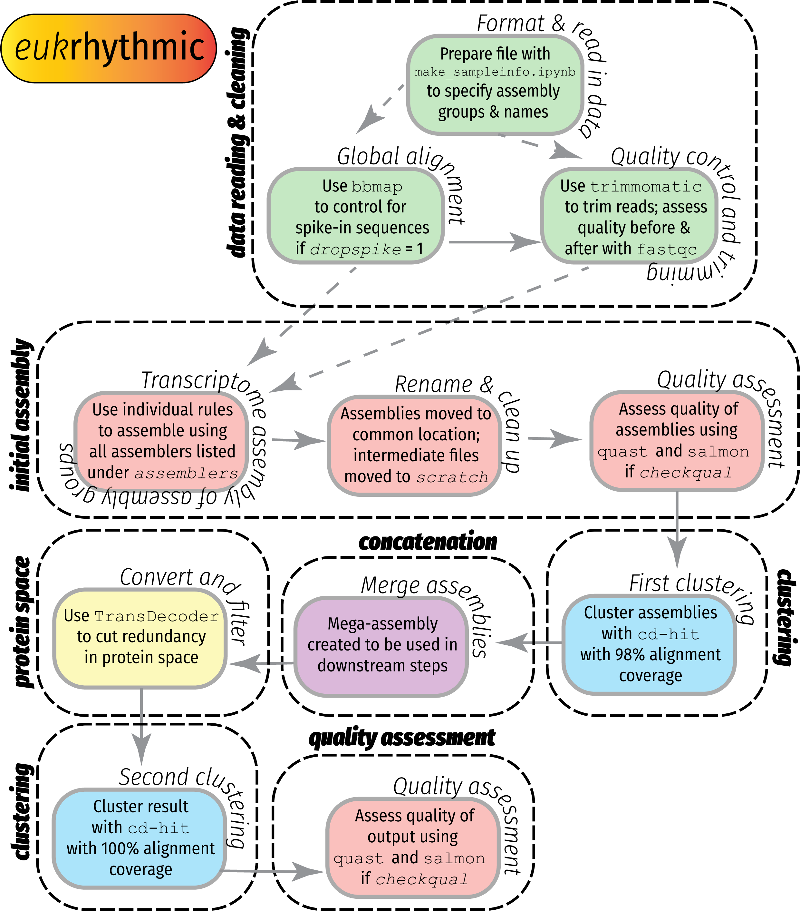

## Metatranscriptomic Pipelining

Documentation for `eukrhythmic` a metatranscriptomics analysis pipeline that enables users to run 

- Trimming
- Quality statistics
- Assembly (using several available assemblers)
- Assembly analysis / quality comparisons

## Initializing the pipeline

Initialize the pipeline by setting up a `conda` environment, such that all the requested packages are loaded. 

```
conda env create metatrans --file environment.yaml
```

## Pipeline schematic



## How to use the pipeline

To use the pipeline, the most important thing to do is to populate `config.yaml` with the paths to your particular input and output directories. Personalizing this will allow the pipeline to pull the relevant files when computing the results of individual rules, so this step is crucial. 

All input `fastq` files must be contained in the same directory, the `inputDIR` location in the `config.yaml` file. Only these metatranscriptomic data will be included in the analysis. These files do _not_, however, need to be located inside the `eukrhythmic` directory (and it is recommended that they are located elsewhere). 

The next thing that needs to be done is to produce the sample file, containing all of the relevant information to run the 

## The `metaT_sample` file 

In the `config.yaml` file, there is a listing for a file called `metaT_sample` in the configuration file. This is essentially the data input source as far as what sample names you are expecting to include in your analysis, as well as any other information about the samples that you would like to be used. This is essential if you would like to apply groupings and co-assemble several samples together, and in general it is essential for the pipeline to work as intended. 

Depending on the application, some columns of this file must be added or may not be necessary. For example, for repeated samples in the same location, the latitude and longitude may not be necessary, because geographic variation in the metatranscriptomic assembly will not be evaluated. Any data that are not included in the default steps in the provided script can be excluded. 

As detailed in `scripts/make_sampleinfo.ipynb`, the minimum required to run the general (default) pipeline without any comparative analysis between samples are the "SampleName", "SampleID" and the "FastqFileNames". SampleName and SampleID can be identical if no such distinction exists in your sample. In /scripts/, there is a Python script that will generate the `fastq` file names column, given your data input folder. If you use this script, all of the files with the fastq extension listed in your `INPUTDIR` that have a match to entries in your SampleID column will be included. This script also has a toggle for creating the metaT\_sample file essentially from scratch, in the case that you (1) want all `fastq` files to be included and (2) do not care about the choice of SampleID. 

In the event that you want more control over how your samples are named, use `scripts/make_sampleinfo.ipynb`. The AssemblyGroup column may be omitted if you do not mind if your samples are assigned assembly groups according to numbers 1-_n_, where _n_ is your number of samples, but in this case `separategroups` must be set to 0 in your `config.yaml` file. (_In the future, this may be updated to be done automatically if the column is absent, as well_). 

Once you have generated the `metaT_sample` file containing the information about your samples, and have populated `config.yaml` with the relevant directories, including, importantly, `outputDIR`, which will be the location of your results, you are ready to run the pipeline.

## Running the pipeline

Once the pieces are in place, and you have either activated an environment using `environment.yaml` or otherwise installed `snakemake`, you can run the pipeline using:

```
sbatch submit/snake_submit.sh
```

If you are using the `SLURM` scheduler, or by simply executing the `submit/snake_submit.sh` file in the `eukrhythmic` directory if you are not using a scheduler, or are logged into a computer with sufficient computational resources (e.g., a `SLURM` job run in interactive mode). 