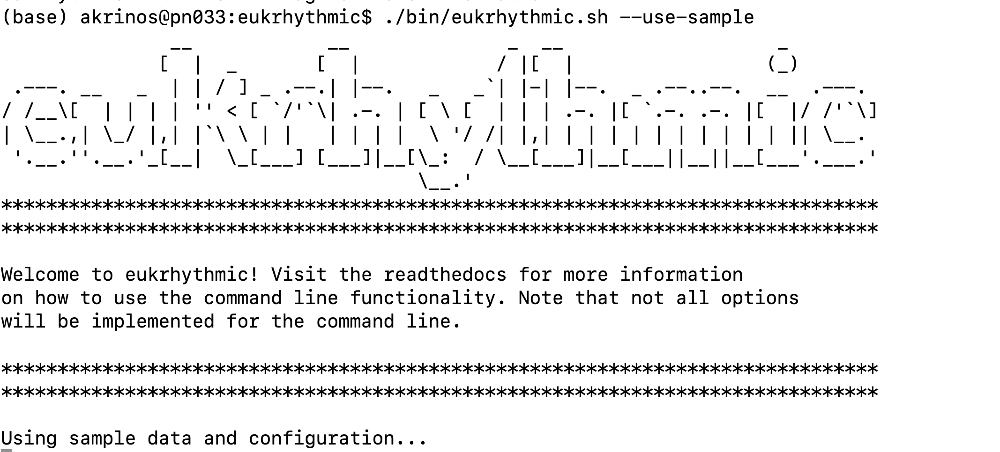
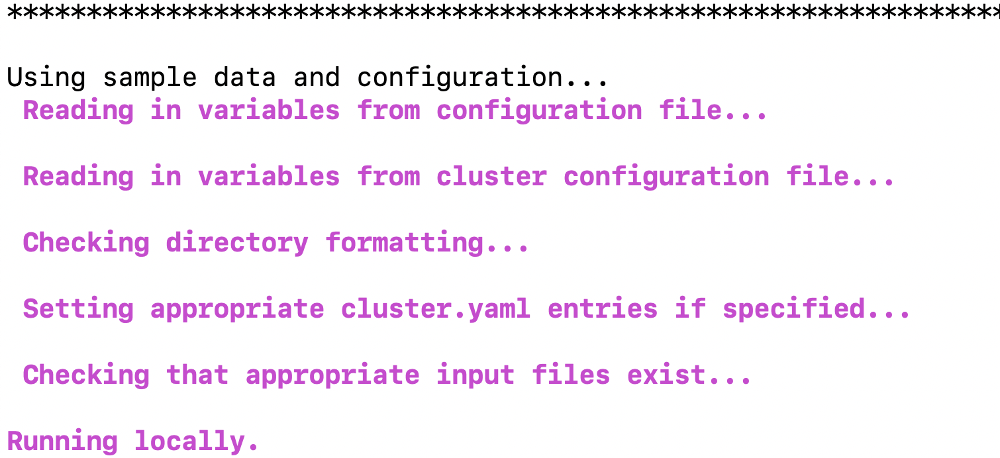

Running eukrhythmic with the sample data
========================================

Note that running eukrhythmic on the sample data will take a little while. When we tested this functionality on our system, we used the following amounts of time and memory:

test sample SLURM code: 2826247

The sample data being run can be found in ``input/testdata/``, and contains five small sample raw read files. The sample metaT file for this dataset in in ``input/sampledata.txt``::

    SampleName	SampleID	AssemblyGroup	FastqFile
    HN008_subsampled	HN008	samplegroup1	HN008/HN008_subsampled
    HN009_subsampled	HN009	samplegroup2	HN009_subsampled
    HN016_subsampled	HN016	samplegroup1	HN016_subsampled
    HN036_subsampled	HN036	samplegroup2	HN036_subsampled
    HN043_subsampled	HN043	samplegroup2	HN043_subsampled
    
In the ``SampleName`` column, we put our longer descriptive name that matches our filename, whereas ``SampleID`` contains the smallest unique token we can make out of our sample names. In ``AssemblyGroups``, we list the files we want the assembly software to have to assemble simultaneously. Even though all of our samples will eventually get combined, some of them will be treated independently to begin with by the assembly tools, and others won't. In this example, HN008 and HN016 are likely from the same site, for example.

In ``FastqFile``, we use the full path of the file relative to the sample directory (which in our case is ``input/testdata``). ``HN008`` has a subdirectory, so this syntax lets us leave our file organization as it is as we're running eukrhythmic.

To run ``eukrhythmic`` on the provided sample data, invoke ``eukrhythmic`` on a clean install of the program without arguments. You can also run the sample data by using the argument ``--use-sample``, which will copy the relevant configuration entries. 

  
Without any additional flags, ``eukrhythmic`` will be run against the provided sample data on your local machine (or your current node on the cluster, if you're logged into one). You should see a dialogue like this one:

