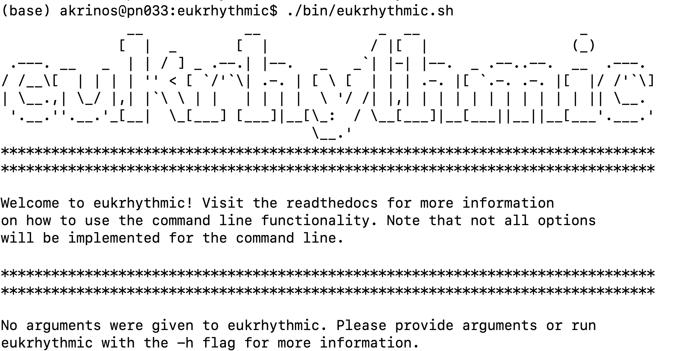
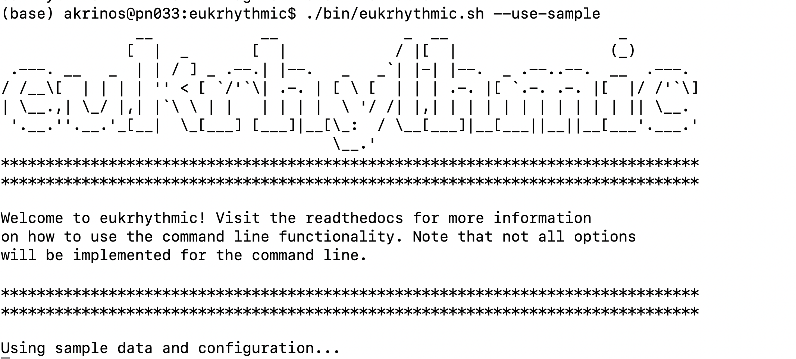
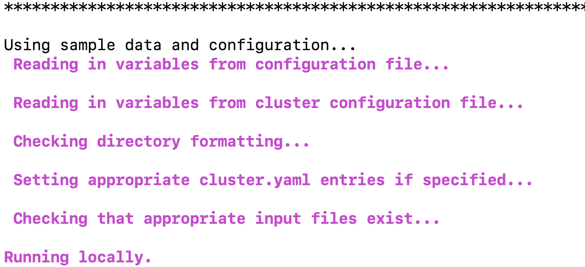

Using eukrhythmic
=================

How to use the pipeline
-----------------------

There are three main options for using the pipeline: you can run the pipeline directly using command-line arguments (:ref:``commandline``), you can set up a simple batch script with those command line options, and run it via ``SLURM`` (:ref:``snake``), or you can treat the pipeline as a normal ``Snakemake`` workflow, and edit its components manually (:ref:``pipeline``) by changing the configuration file.

.. _commandline:

Running the pipeline from the command line
------------------------------------------

To run the pipeline from the command line, you likely still want to make sure that the sample file is generated the way you intend. To explore what goes into this file, and the way it will be autogenerated when executing ``eukrhythmic`` from the command line, please read the section on file naming (:ref:``naming``) below.

Other than that, to execute ``eukrhythmic`` from the command line is to alias the executable while in the ``eukrhythmic`` base directory after cloning from ``GitHub``, like so::

    alias eukrhythmic='./bin/eukrhythmic.sh'

And then invoke::

    eukrhythmic <arguments>
    
Or invoke, standalone::

    ./bin/eukrhythmic.sh <arguments>
    
if you prefer.
    

To run ``eukrhythmic`` on the provided sample data, invoke ``eukrhythmic`` on a clean install of the program without arguments. You can also run the sample data by using the argument ``--use-sample``, which will copy the relevant configuration entries. 

  
Without any additional flags, ``eukrhythmic`` will be run against the provided sample data on your local machine (or your current node on the cluster, if you're logged into one). You should see a dialogue like this one:

The exception is if you are running on an HPC system that uses the ``SLURM`` scheduler, invoke ``eukrhythmic`` with one argument: ``-l`` or ``--slurm`` to leverage your computing resources. In that case, you will also want to invoke ``sbatch eukrhythmic --slurm``, to avoid running any steps on your current remote machine. You can also use the ``-np`` or ``--dry_run`` flag to run do a ``Snakemake`` dry run, to see whether the jobs to be run align with your expectation (you can do this whether or not you are using a scheduler). A list of additional arguments required commonly by users is given below: 

.. list-table:: Title
   :widths: 25 25 50
   :header-rows: 1
   
   * - Flag
     - ``config.yaml`` entry
     - Meaning
   * - ``-n`` / ``--job-name``
     - jobname 
     - A descriptive/unique name to be applied to SLURM jobs.
   * - ``-s`` / ``--sample-file-name``
     - metaT_sample
     - The listing of SampleIDs, SampleNames, FastqFiles, and assembly groups for each sample.
   * - ``-o`` / ``--out-dir``
     - outputDIR
     - The output directory to write to.
   * - ``-i`` / ``--in-dir``
     - inputDIR
     - The location of the sample FASTQ files (crucial unless running sample data).
   * - ``-q`` / ``--check-quality``
     - checkqual
     - Takes no arguments. If specified, quality assessment is run on assemblies.
   * - ``-b`` / ``--run-bbmap``
     - runbbmap; spikefile
     - If your data contains spiked reads, you can list this flag and specify a FASTA file containing the spike.
   * - ``-l`` / ``--slurm``
     - N/A
     - If provided, run ``snakemake`` on SLURM.
   * - ``-g`` / ``--generate-file``
     - N/A
     - If provided, create the sample file automatically from the files present in the input directory.
   * - ``--use-sample``
     - N/A
     - If provided, override all other parameters and run the sample file.
   * - ``-c`` / ``--scratch-dir``
     - scratch
     - Takes argument of the directory to be used as scratch space.

.. _snake:

Running the pipeline directly with Snakemake
--------------------------------------------

You can use the command-line arguments described above if you run the pipeline from ``submit/eukrhythmic.sh``. Submitting this, customized with whatever arguments you prefer, to a scheduler (from the home directory) will run the pipeline in full. 

To use the pipeline, the most important thing to do is to specify the paths to your particular input and output directories. Personalizing this will allow the pipeline to pull the relevant files when computing the results of individual rules, so this step is crucial. You can edit the configuration file randomly, or use the command-line options specified above (:ref:``command``). Specifically, you would change this line in ``eukrhythmic.sh``::

    eukrhythmic --use-sample --slurm

And add an ``in-dir`` flag like so::

    eukrhythmic --use-sample --in-dir <name-of-your-input> --out-dir <name-of-your-output>

All input ``fastq`` files must be contained in the same directory, the ``inputDIR`` location, specified by the ``--in-dir`` flag. Only these metatranscriptomic data will be included in the analysis. These files do *not*, however, need to be located inside the ``eukrhythmic`` directory (and it is recommended that they are located elsewhere). 

The next thing that needs to be done is to produce the sample file, containing all of the relevant information to run the pipeline. You can create this yourself (:ref:``manual``), using only a list of Sample IDs (:ref:``fastqauto``), or completely automatically (:ref:``fullauto``), which can be done all in one with the ``eukrhythmic`` bash script, by specifying::

    eukrhythmic --use-sample --in-dir <name-of-your-input> --out-dir <name-of-your-output> -g

using the ``-g`` or ``--generate-file`` option, which runs the included script (:ref:``fullauto``).

If you are using the ``SLURM`` scheduler, you can run the pipeline by adding/keeping the ``--slurm`` flag in the ``eukrhythmic`` command, after configuring options for your particular system (:ref:``slurm``), or by setting the ``rewritecluster`` configuration flag to 1, and specifying the options for all jobs in the ``required`` section of the ``cluster.yaml`` file.

.. _pipeline:

Running the pipeline manually
-----------------------------

To use the pipeline as a ``Snakemake`` workflow manually, the most important thing to do is to populate ``config.yaml`` with the paths to your particular input and output directories, and to generate the sample file (either manually (:ref:``manual``) or using a semi (:ref:``fastqauto``) or completely (:ref:``fullauto``) automatic procedure. Personalizing this will allow the pipeline to pull the relevant files when computing the results of individual rules, so this step is crucial. You should also edit any other important parts of the configuration file, as described here (:ref:``config``).

Once the pieces are in place, and you have either activated an environment using ``environment.yaml`` or otherwise installed ``snakemake``, you can run the pipeline using::

    sbatch submit/snake_submit.sh <snakefile> <number of jobs> <optionally, --rerun-incomplete>
    
Or, wrapping this command with the ability to specify ``eukrhythmic`` subroutines rather than selecting a configuration file, you can invoke ``eukrhythmic`` with::

    python submit/eukrhythmic <subroutine>
    
Where "<subroutine>" is the subset of eukrhythmic functionality that you wish to use for this run. In most cases, you'll write "all" here, to indicate that you wish to run all of the steps of the pipeline sequentially.

If you are using the ``SLURM`` scheduler, you can run the pipeline by executing the ``submit/snake_submit.sh`` file in the ``eukrhythmic`` directory, after configuring options for your particular system (:ref:``slurm``), or by setting the ``rewritecluster`` configuration flag to 1, and specifying the options for all jobs in the ``required`` section of the ``cluster.yaml`` file. If you are not using a scheduler, or are logged into a computer with sufficient computational resources (e.g., a ``SLURM`` job run in interactive mode), you can execute ``Snakemake`` directly. 

You can also do this using the ``submit/eukrhythmic`` script <Arianna needs to explain this script and the subroutines. She also needs to add ability to specify subroutines in the ``bin/eukrhythmic`` file.>

.. _slurm:

Running the pipeline with ``SLURM``
-----------------------------------

In order to run the pipeline with ``SLURM`` or any other similar scheduling platform on an HPC system, the file ``cluster.yaml`` in the base directory needs to be populated. Specifications for individual rules can be added or removed as needed; the default configuration is what must absolutely be specified for the pipeline to run properly. Make sure that you include the following:

- Your account name
- Any flags that you typically use when running commands on the system, in the ``__default__``->``slurm``->``command`` string
- The partition of your system that you plan to use, as ``queue``. By default, this might be ``compute`` or ``normal``.

If you set your account name at the top of the ``cluster.yaml`` file, as well as setting the default partition just once, and you do not change the parameter ``rewritecluster`` to 0 in ``config.yaml``, you can use the command line interface or the provided submission file to circumvent filling out the rest of ``cluster.yaml``. You can also do this by invoking ``python scripts/importworkspace.py`` once before running the pipeline, if you already have a valid ``config.yaml``. If you do this, you won't need to change these values for the specifications for all of the individual rules, unless you have specific computational needs or usage requirements, in which case you should set ``rewritecluster`` to 0. If defaults are not specified at the beginning of the ``cluster.yaml`` file for the user, maximum memory usage, maximum number of cores, and maximum number of threads, ``eukrhythmic`` will not execute successfully and an error will be thrown.

Running the pipeline with ``PBS``
---------------------------------

There are four flags you can use with the ``python submit/eukrhythmic`` command for the use of an alternative scheduling system. These presently include the ``pbs`` and ``slurm`` systems; ``slurm`` is accessible with ``--system slurm`` or ``--system sbatch``, and ``pbs`` is accessible with ``--system pbs`` or ``--system qsub``. PBS is presently in beta mode for testing purposes, but should function more or less identically to the use of the ``SLURM`` system.

Setting CPUs and memory requirements
------------------------------------

As a general rule for memory-intensive assemblers, the memory available to the process should be about ten times the number of cores/CPUs that you have available to you on the machine. For example, if using a machine with 30 cores available and 300 GB of available memory, you may want to configure your jobs to use 15 cores and 150 GB of memory, to allow two jobs to run concurrently on one node, and optimize memory relative to number of cores.